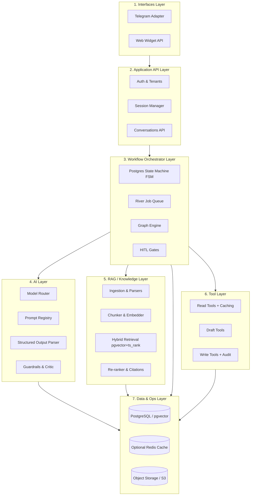
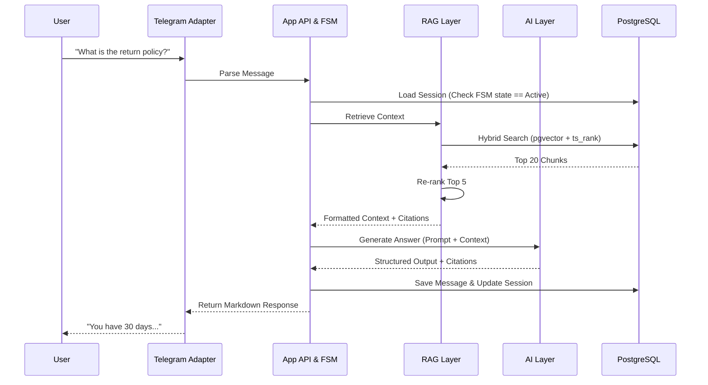
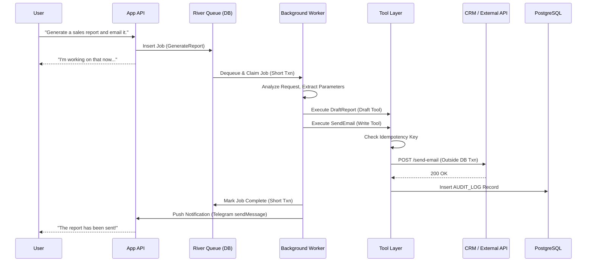
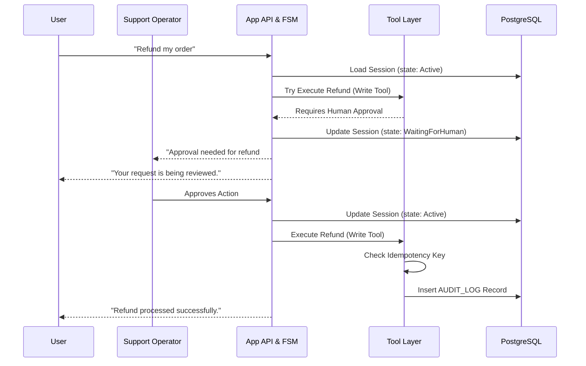
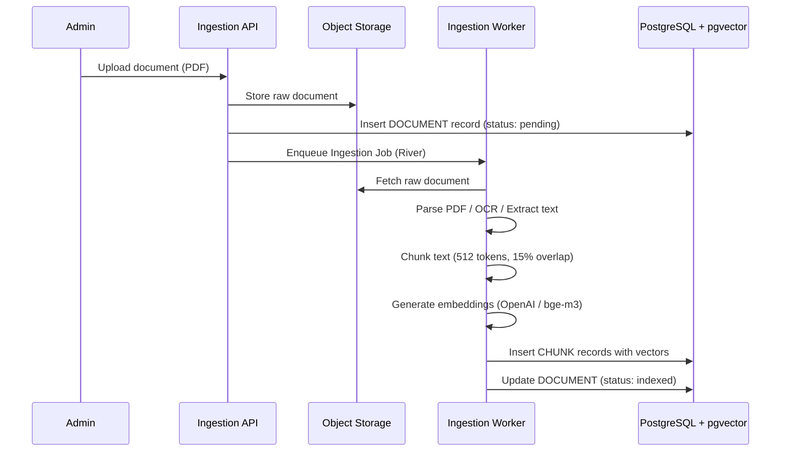
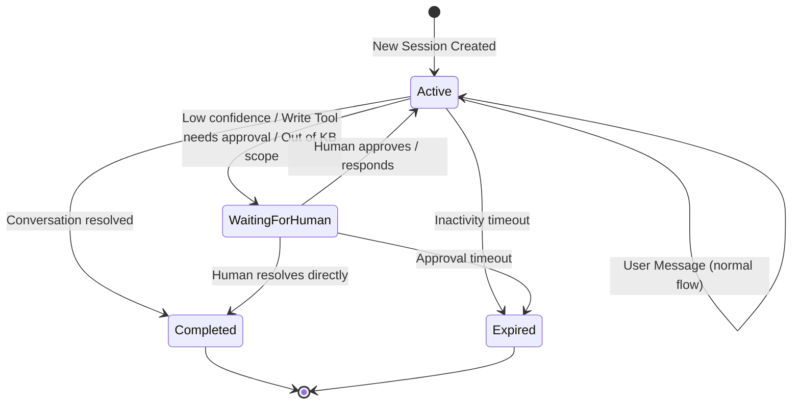
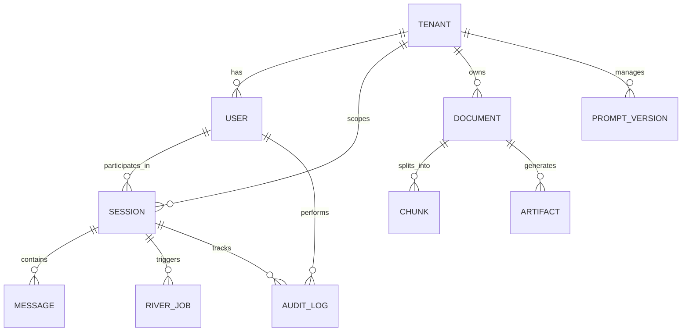

# Comprehensive Architecture Description (Ragivka Framework)

This document provides a deep dive into the Ragivka architecture, detailing every component, its responsibilities, interactions, and the underlying data models.

## 1. High-Level Layered Architecture

Ragivka is organized into seven distinct, decoupled layers.



## 2. Component Descriptions

### 2.1 Interfaces Layer (FR-21, FR-22)

The entry points into the framework.

*   **Telegram Adapter:** Webhook-based integration via `gotgbot`. Handles message parsing, Markdown/HTML response formatting, and inline keyboard interactions. This is the primary channel for v1 (8 of 10 investigated projects use Telegram).
*   **Web Widget API:** REST + WebSocket endpoints for embedding a chat UI on client websites. Authentication via tenant-scoped API keys. The widget is loaded as an external script that doesn't impact site loading speed.

### 2.2 Application API Layer

Handles business logic boundaries and access control.

*   **Auth & Tenants (NFR-16):** Ensures every request is mapped to a specific tenant. Validates API keys. All downstream queries inherit the `tenant_id` filter.
*   **Session Manager (FR-5, FR-6, FR-7):** Manages the lifecycle of user conversations. Creates new sessions, resumes existing ones, and auto-expires inactive sessions via a configurable timeout.
*   **Conversations API:** CRUD operations for chat histories. Messages are stored in PostgreSQL with `role` (user/assistant/system), content, citation references, and token counts. Strictly tenant-isolated.

### 2.3 Workflow Orchestrator Layer

The heart of Ragivka, responsible for reliable execution.

*   **Postgres State Machine / FSM (FR-5, NFR-6):** Tracks conversation states (`Active`, `WaitingForHuman`, `Completed`, `Expired`). Uses optimistic locking (`version` column) to prevent race conditions from concurrent messages.
*   **River Job Queue (NFR-5, NFR-7):** The asynchronous engine. Handles long-running L2/L3 tasks using PostgreSQL transactions to guarantee at-least-once delivery, exponential backoffs, and dead-letter queues. External API calls are always made OUTSIDE the River transaction to prevent connection pool exhaustion.
*   **Graph Engine (FR-4):** A lightweight DAG engine used only for L3 tasks (e.g., routing work between a Researcher, Critic, and Writer). Includes configurable per-node timeouts and deadlock detection for Critic/Generator loops.
*   **HITL Gates (FR-17):** Pauses execution and transitions the FSM to `WaitingForHuman` when: (a) confidence is low, (b) a Write Tool requires human approval, or (c) the query falls outside the knowledge base scope. Notifications are sent to the designated operator via Telegram message or webhook callback.

### 2.4 AI Layer

Abstracts away the underlying LLM providers.

*   **Model Router (FR-13, NFR-8):** Dynamically routes requests based on task complexity and cost policy. Cheap models (GPT-4o-mini, Haiku) for intent classification and extraction; expensive models (Sonnet, GPT-4o, DeepSeek-R1) for complex reasoning. Supports automatic fallback on provider failure.
*   **Prompt Registry (FR-14):** Version-controlled storage for system prompts in PostgreSQL. Prompts are loaded by name + version, preventing drift between deployments. Changes to prompts are tracked for audit.
*   **Structured Output Parser (FR-15):** Forces LLMs to return strict JSON matching Go struct definitions via JSON-schema constraints or function-calling mode. This enables deterministic downstream processing.
*   **Guardrails & Critic (NFR-14):** Evaluates LLM outputs for hallucination. Cross-references generated answers against RAG-retrieved chunks. In v1, this acts as an evaluation hook (tracking Citation Coverage and Retrieval Recall@K). Runtime blocking (regenerating or flagging for human review) is deferred to v2/L3.

### 2.5 RAG / Knowledge Layer

The ingestion and retrieval engine.

*   **Ingestion & Parsers (FR-8):** Connectors fetch raw data (PDFs, URLs, DB rows) and store originals in Object Storage. Parsers (including OCR for scanned engineering PDFs with tables and diagrams) normalize text. Supports document versioning, re-ingestion on source change, and stale chunk cleanup.
*   **Chunker & Embedder (FR-9):** Splits text (default: 512 tokens, 15% overlap) and generates vectors via OpenAI, Cohere, or local bge-m3 (Ollama). Chunks retain metadata: `document_id`, ordinal position, and source location for citation linking. Embedding model must handle Cyrillic text (NFR-19).
*   **Hybrid Retrieval (FR-10):** Executes queries against PostgreSQL using both `pgvector` HNSW index (semantic similarity) and `tsvector` GIN index (ts_rank keyword matching). Results are merged and deduplicated. Essential for domains with exact terminology (legal terms, ISBNs, product SKUs).
*   **Re-ranker & Citations (FR-11, FR-12):** A cross-encoder re-ranker (Cohere Rerank or local BGE reranker) re-orders the top K results to maximize precision. Every answer includes traceable citations linking back to specific source chunks with document name and chunk ordinal.

### 2.6 Tool Layer (FR-16, FR-17, FR-18, NFR-10)

Provides the AI with deterministic, permissioned actions via a Tool Registry (MCP-compatible transport).

*   **Read Tools + Caching:** Safe, read-only API calls (e.g., query PrestaShop for product price, check CRM for order status). Responses from slow or rate-limited external APIs are cached with configurable TTL to avoid overloading legacy systems.
*   **Draft Tools:** Safe actions that prepare execution without committing (e.g., draft an email, preview a report, prepare a cart summary).
*   **Write Tools + Audit:** State-mutating actions (e.g., charge a card, create a CRM lead, add to shopping cart, send an email). These MUST implement idempotency keys and generate persistent records in the `AUDIT_LOG` table. Write Tools marked as requiring approval trigger the HITL gate flow.

### 2.7 Data Layer

The absolute source of truth.

*   **PostgreSQL (NFR-3):** Stores everything: Tenants, Users, Sessions, Messages, River Jobs, Prompts, Vectors (via `pgvector`), and Audit Logs. This ensures atomic backups and transactional consistency across the entire framework.
*   **Optional Redis Cache (NFR-6):** Used *only* for ephemeral data: rate limiting, fast session-lock checking, and caching expensive embedding lookups. Never used for durable state.
*   **Object Storage / S3 (FR-20):** Stores raw uploaded documents (pre-parsing), generated PDF/Excel artifacts, and other binary outputs. Referenced by `document_id` and `artifact_id` in PostgreSQL.

---

## 3. Interaction Lifecycles (Data Flow)

### Scenario A: Synchronous RAG Request (L1)

Used for fast, simple Q&A. Must complete within webhook timeout limits (< 10s). Validates Case Studies 1, 3, 4.



### Scenario B: Asynchronous Job with Write Tool (L2)

Used for durable multi-step pipelines. External API calls are made OUTSIDE the database transaction (NFR-7). Validates Case Studies 2, 5, 6.



### Scenario C: Human-in-the-Loop Write Approval (HITL)

Used when a Write Tool requires explicit human authorization. Validates Case Studies 3, 4. Maps to FR-17.



### Scenario D: Document Ingestion Pipeline

Used to populate the knowledge base. Validates Case Studies 1, 5, 6. Maps to FR-8, FR-9.



---

## 4. FSM State Transition Diagram



---

## 5. Core Data Model Relations

The PostgreSQL database acts as the central nervous system. All entities are strictly isolated by `tenant_id`.



*   **TENANT:** The absolute security boundary. Every downstream table includes a `tenant_id` foreign key.
*   **USER:** An end-user interacting via a Channel. Contains `channel_type` (telegram/web) and `channel_id` (e.g., Telegram user ID).
*   **SESSION:** The FSM container. Contains `state` enum, `version` (optimistic locking), `orchestration_tier` (L0–L3), `channel`, and `expires_at`.
*   **MESSAGE:** Individual chat turns. Contains `role` (user/assistant/system), `content`, `citation_refs[]`, `token_count`, and optional `job_id` for async replies.
*   **RIVER_JOB:** Tracks async tasks. Links to a Session via `session_id` and includes `tenant_id`, `idempotency_key`, `payload` (JSONB), and `attempt` count.
*   **AUDIT_LOG:** Immutable ledger recording every Write Tool execution. Contains `tool_name`, `idempotency_key`, request/response hash, and optional `approval_record` for HITL actions.
*   **DOCUMENT:** A raw file uploaded to the Knowledge Layer. Contains S3 key, `version`, `ingestion_status` (pending/indexed/stale), and `tenant_id`.
*   **CHUNK:** Text segments belonging to a Document. Contains `document_id`, ordinal position, `content`, `vector` (pgvector), `tsvector` (BM25), and metadata for hybrid search filtering.
*   **PROMPT_VERSION:** Version-controlled system prompts. Contains `name`, `version`, `content`, and `created_at`.
*   **ARTIFACT:** Generated output files (PDF, Excel). Contains `session_id`, S3 key, `type`, and `created_at`.

## 6. Security and Boundaries

*   **Tenant Isolation (NFR-16):** All database queries are filtered by `tenant_id` at the repository layer. Vector searches apply `tenant_id` metadata filtering. Cross-tenant data leakage is architecturally impossible.
*   **Prompt Injection Defense (NFR-17):** User input passes through strict JSON-schema validation before being interpolated into tool arguments. The Read/Draft/Write permission boundary ensures the LLM cannot invoke dangerous tools without explicit registration.
*   **PII Handling (NFR-18):** PII stripping hooks are available in the ingestion pipeline. For offline deployments using Ollama, data never leaves the local machine.
*   **Error Propagation (NFR-5):** If a River job fails, it retries with exponential backoff. After exhausting retries, it moves to a dead-letter queue for manual inspection. Errors are logged with the full OpenTelemetry trace ID.
*   **Deployment View (NFR-9):** Designed as a statically compiled single Go binary. In small deployments, the API server and River workers run in the same process. In high-scale deployments, the binary runs in "API Mode" or "Worker Mode" for independent horizontal scaling. Offline mode uses Ollama for LLM + bge-m3 for embeddings.

## 7. Package Structure

```text
ragivka/
├── cmd/
│   ├── server/           # API server entrypoint
│   └── worker/           # River worker entrypoint
├── internal/
│   └── config/           # Viper-based configuration
├── pkg/
│   ├── runtime/          # Session FSM, River integration, HITL gates
│   ├── aicore/           # Model Router, Prompt Registry, Structured Output
│   ├── knowledge/        # Ingestion, chunking, pgvector retrieval, re-ranking
│   ├── channel/          # Telegram adapter, Web Widget API
│   ├── tools/            # Tool Registry (Read/Draft/Write), Function Calling, caching
│   ├── guardrails/       # Critic, citation validation, evaluation hooks
│   └── graph/            # Optional L3 DAG engine
└── docker-compose.yml    # PostgreSQL + pgvector (+ optional Redis)
```
